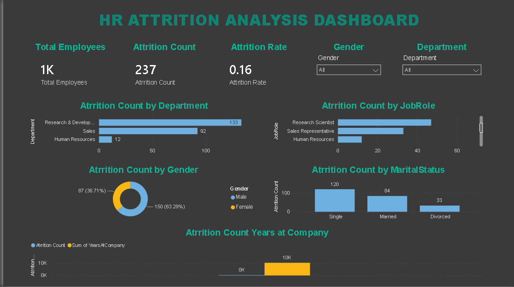
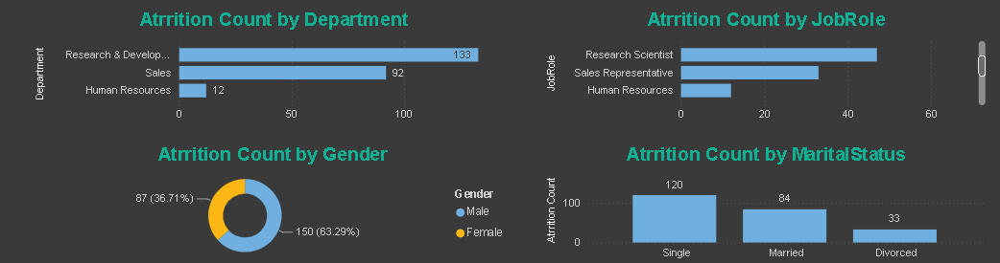
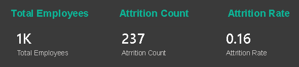

# HR Attrition Analysis Dashboard

## Overview
This project analyzes employee attrition using SQL, Excel, and Power BI to identify workforce trends and key factors influencing employee turnover.

## Tools Used
- SQL
- Power BI
- Microsoft Excel

## Features
- Employee Attrition Rate
- Department-wise Analysis
- Job Role Analysis
- Gender-wise Attrition
- Age Group Analysis
- Interactive Filters (Slicers)
- KPI Dashboard

## Dataset
IBM HR Analytics Employee Attrition Dataset
## Dashboard Preview

### Overview

### Department Analysis

### KPI Dashboard

## Author
Nida Tabassum
